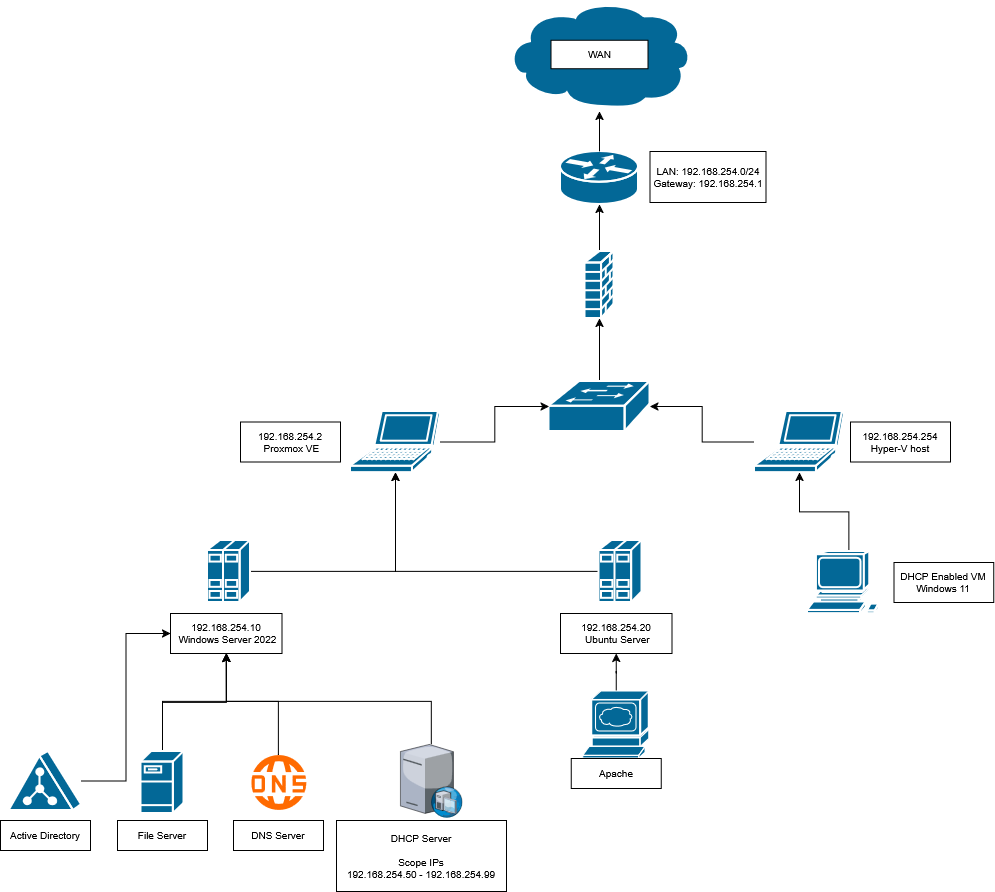

# Network Topology

[← Infrastructure ](./README.md)

This page documents the network topology used in my home lab environment.

### Physical Devices

| Device | IP Address | Role |
|----------|----------|----------|
| ZTE T5400 | 192.168.254.1 | Router |
| Lenovo ThinkPad L480 | 192.168.254.2 | Proxmox Host |
| Lenovo ThinkPad E16 | 192.168.254.254 | Hyper-V Host |

### Virtual Machines

| VM | IP Address | Role |
|----------|----------|----------|
| WINSERV-01 | 192.168.254.10 | Active Directory Domain Controller, File Server, DHCP, DNS |
| WIN11-01 | DHCP Assigned | Simulated User Workstation |
| UBUNTU-01 | 192.168.254.20 | Linux Server |

## Network Diagram

