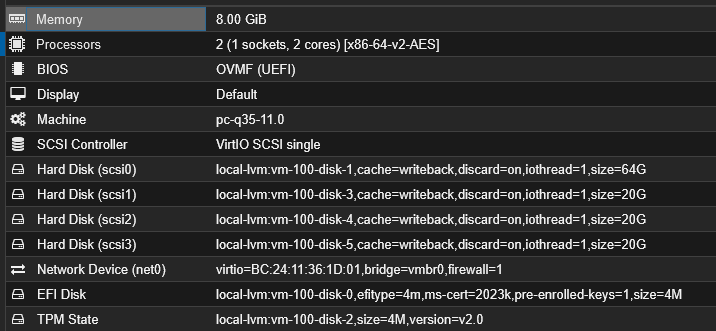

# Windows Server 2022

[← Back To Home](../README.md) |

## Overview

This section presents the configuration of Windows Server 2022 with all services running.

## System Configuration

* **Hostname:** WINSERV-01
* **Active Directory domain:** siejak.local
* **IPv4 address:** 192.168.254.10
* **IPv6:** Disabled

## Services

| Project | Description |
|----------|-------------|
| [AD DC](./addc.md) | Active Directory Domain Services, OUs, GPOs |
| [DHCP](./dhcp.md) | Dynamic Host Configuration Protocol  |
| [File Server](./fileserver.md) | Shared file storage for centralized user profile storage. |

## Virtual Hardware Configuration

