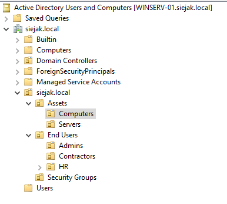

# AD DC

[← Back To Windows Server 2022](./README.md)

## Overview

This section documents the configuration of Active Directory Domain Services (AD DS), Organizational Units (OUs), and Group Policy Objects (GPOs).

## Group Policy Objects

### Folder Redirection
Redirects end-user Desktop, Documents, and Downloads folders to a network location.

## Screenshots

### OUs structure 

### Folder Redirection

