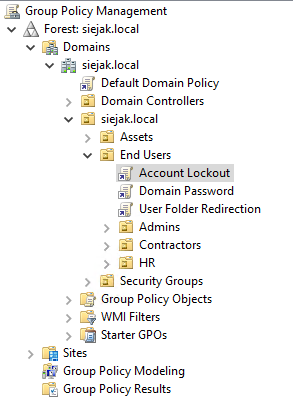
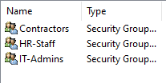
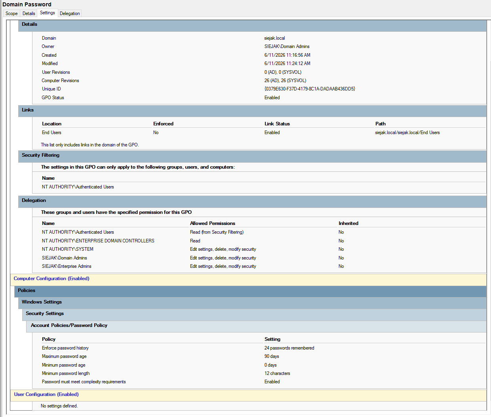
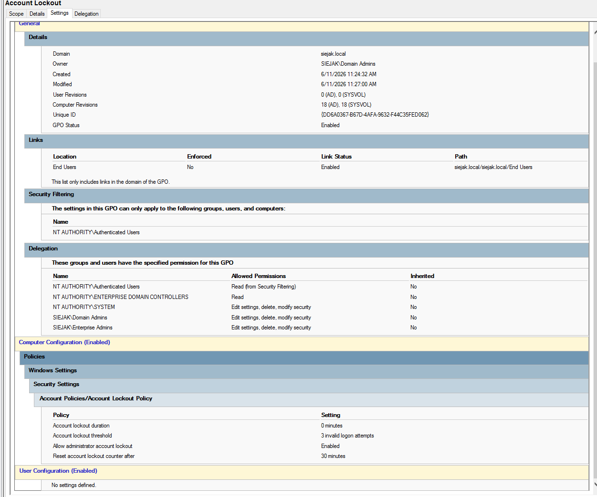

# AD DC

[← Back To Windows Server 2022](./README.md)

## Overview

This section documents the configuration of Active Directory Domain Services (AD DS), Organizational Units (OUs), and Group Policy Objects (GPOs).

## Group Policy Objects

### Folder Redirection
Redirects end-user Desktop, Documents, and Downloads folders to a network location.

### Password Policy

* **Enforce password history** 24 passwords remembered 
* **Maximum password age** 90 days 
* **Minimum password age** 0 days 
* **Minimum password length** 12 characters 
* **Password must meet complexity** requirements Enabled 

### Account Lockout Policy

Brute force attack prevention.

* **Account lockout duration** 0 minutes 
* **Account lockout threshold** 3 invalid logon attempts 
* **Allow administrator account lockout** Enabled 
* **Reset account lockout counter after** 30 minutes 

## Screenshots

### OUs structure 

### GPO placement

### Security Groups

### Folder Redirection

### Password Policy

### Account Lockout Policy

