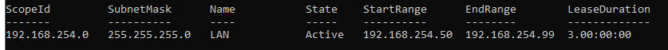
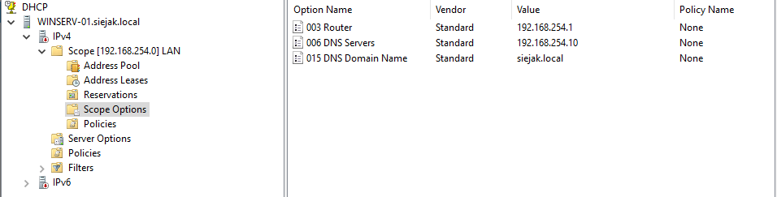

# DHCP

[← Back To Windows Server 2022](./README.md)

## Overview

This section documents the configuration of the Dynamic Host Configuration Protocol (DHCP) used for IPv4 address assignment within my LAN environment.

## Configuration

* **Range:** 192.168.254.50 - 192.168.254.99
* **Lease Time:** 3 days
* **Gateway:** 192.168.254.1
* **DNS:** 192.168.254.10
* **Subnet mask:** 255.255.255.0

## Screenshots

