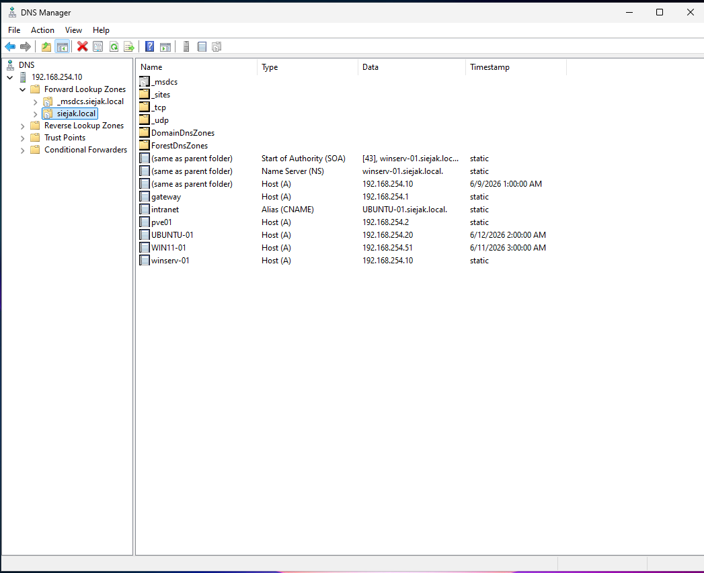

# DNS 

[← Back To Windows Server 2022](./README.md)

## Overview

This section documents the DNS server hosted on the Domain Controller.

* **IP Address:** 192.168.254.10
* **Forwarders:** 8.8.8.8, 8.8.4.4

## Records:

