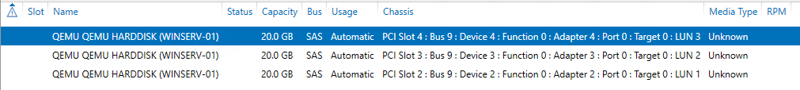
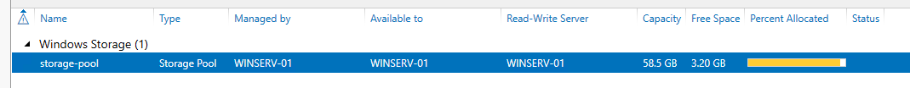
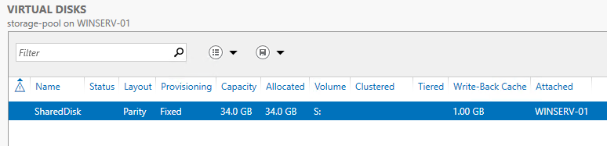
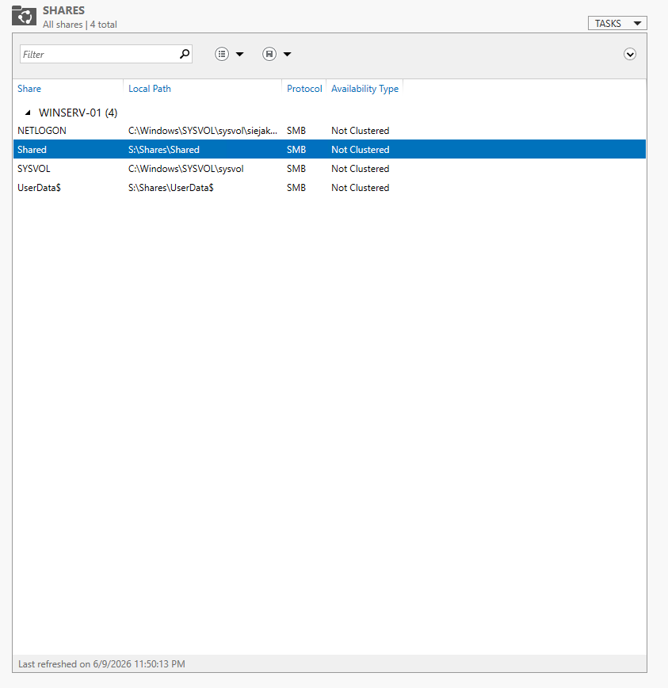
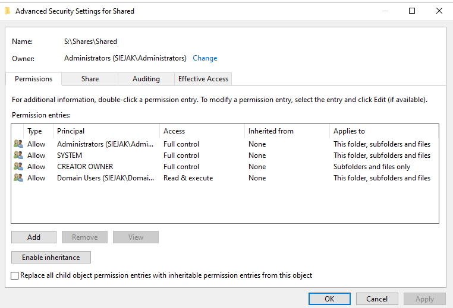
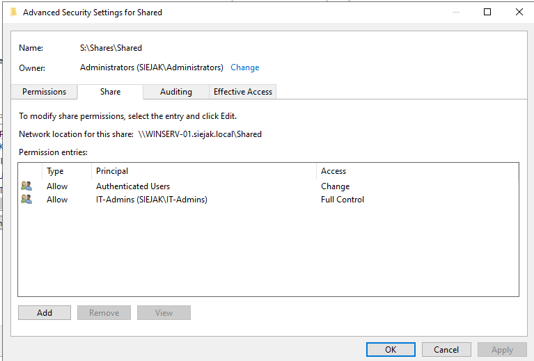

# File Server

[← Back To Windows Server 2022](./README.md)

## Overview

This section describes the configuration of the file server used to provide centralized storage for user profiles and shared data.

## Disks Configuration

### Storage Pool

* **Name:** storage-pool
* **Managed by:** WINSER-01
* **Configuration:** 3 × 20 GB virtual disks
* **Purpose:** Provides the required disk capacity for a parity-based virtual disk.

### Virtual Disk

* **Name:** SharedDisk
* **Layout:** Parity (equivalent to RAID 5)
* **Capacity:** 34 GB
* **Assigned volume:** S:

### Purpose

The file server provides centralized storage for user profiles and shared folders within the lab environment. The parity layout offers fault tolerance while maximizing available storage capacity.

## Share Configuration

* **Name:** Shared  
* **Local path:** S:\Shares\Shared  
* **Network path:** \\WINSERV-01\Shared  

### Permissions

* **Share permissions:** Authenticated Users (Read-only)  
* **NTFS permissions:**
  * Domain Users – Read-only  
  * Administrators – Full Control

## Screenshots

### Physical disks

### Storage pools

### Virtual disks

### Shares

### NTFS Permissions

### Share Permissions

