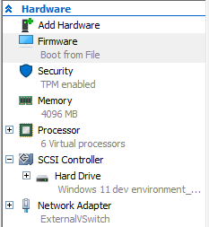
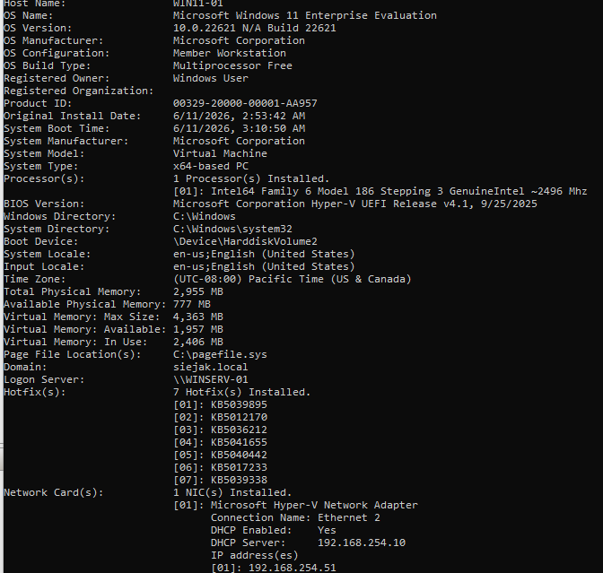
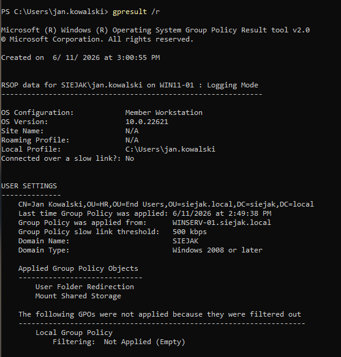
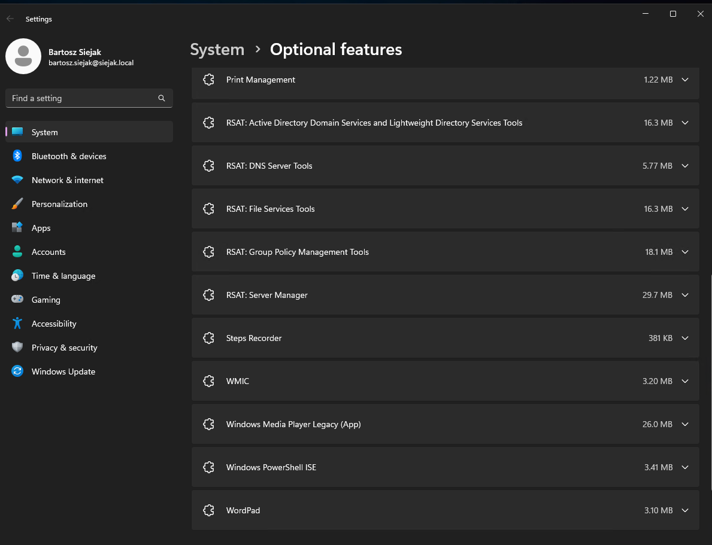

# Hyper-V

[← Back To Home](../README.md) | [Next: Ubuntu Server →](../05-ubuntu/README.md)

## Overview

This section documents a Windows 11 Enterprise virtual machine running on Hyper-V and joined to an Active Directory domain for testing enterprise workstation scenarios.

## Hyper-V Configuration

- Virtualization platform: Hyper-V
- VM generation: Generation 2
- Virtual switch: External switch (LAN bridged)
- Assigned resources:
  - 6 vCPU
  - 4 GB RAM
  - 125 GB disk

## VM Configuration

### Network Configuration

- IP assignment: DHCP (via domain infrastructure)
- DNS server: 192.168.254.10 (Domain Controller)
- Domain: siejak.local
- VM is joined to Active Directory domain

### Domain Integration

The Windows 11 VM is joined to the Active Directory domain (siejak.local).

### Configuration

Installed RSAT for managing the Windows Server on the desktop.

### Verification

I checked whether all applied GPOs, shared drive (permissions) worked like expected.

## Screenshots

### VM Settings

### Domain verification (systeminfo output)

### Resultant Set Of Policy

### RSAT

