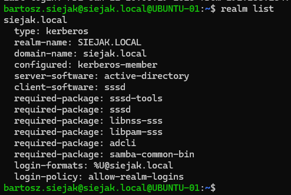
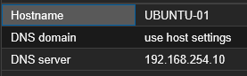
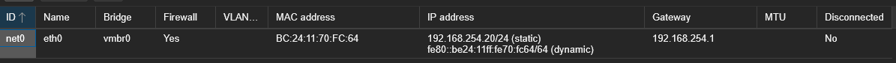
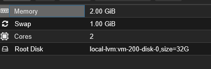

# Ubuntu Server

[← Back To Home](../README.md)

## Overview

This project documents the deployment and configuration of an Ubuntu LXC container on Proxmox VE, integrated with a Microsoft Active Directory Domain Controller.

The server is configured to host an internal intranet website using Apache and to allow centralized authentication through Active Directory.

## Server Configuration

| Setting          | Value            |
| ---------------- | ---------------- |
| Platform         | Proxmox VE       |
| Container Type   | LXC              |
| Operating System | Ubuntu 26.04 LTS |
| Hostname         | `UBUNTU-01`      |
| Domain           | `siejak.local`   |
| IPv4 Address     | `192.168.254.20` |
| DNS Server       | `192.168.254.10` |
| Web Server       | Apache           |

## Purpose

The purpose of this server is to provide an internal Ubuntu-based web server for hosting an intranet site. The server is also joined to Active Directory so domain users and administrators can authenticate using centralized credentials.

## Domain Integration

The Ubuntu container was joined to the Active Directory domain using `realmd` and `sssd`.

Configured domain features include:

1. Joined Ubuntu to the `siejak.local` Active Directory domain
2. Enabled automatic home directory creation for domain users after first login
3. Added the AD group `IT-Admins` to the sudoers configuration
4. Verified domain user login and sudo permissions

## Screenshots

### Domain Join Verification

### Container Settings

